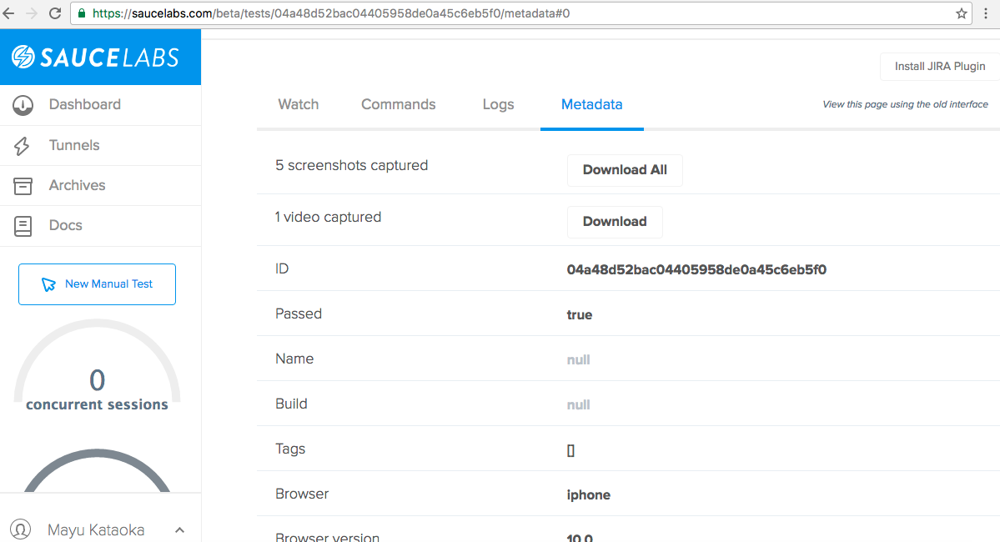
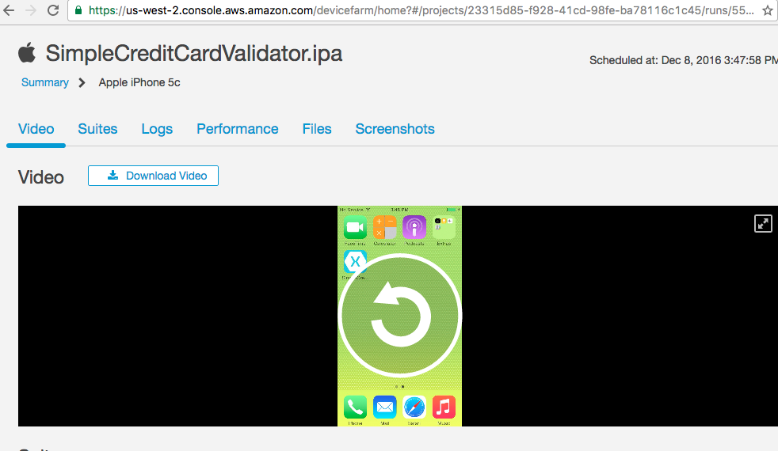
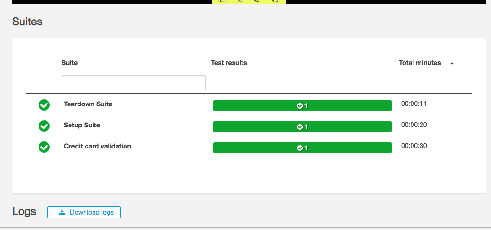
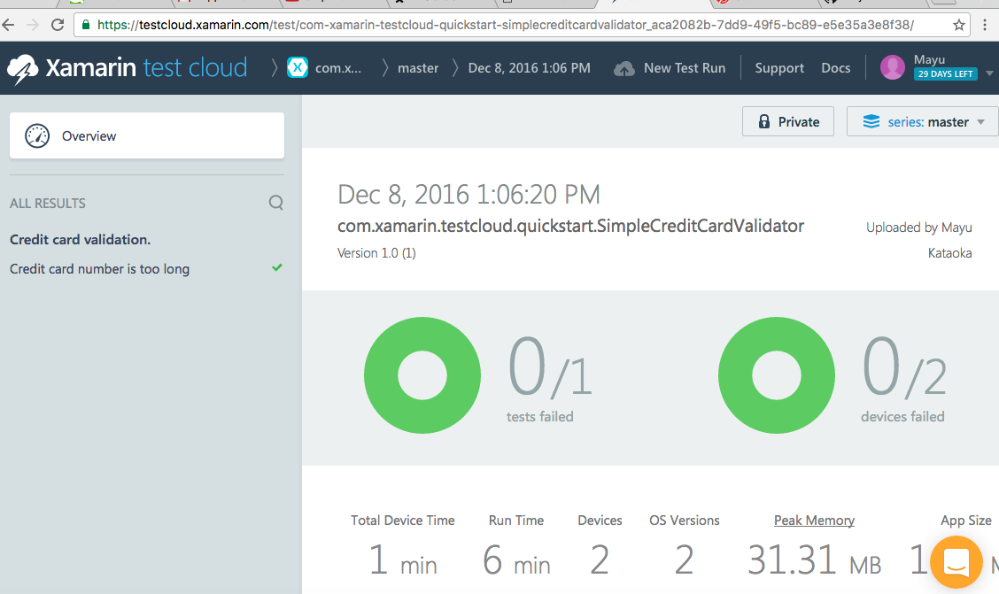
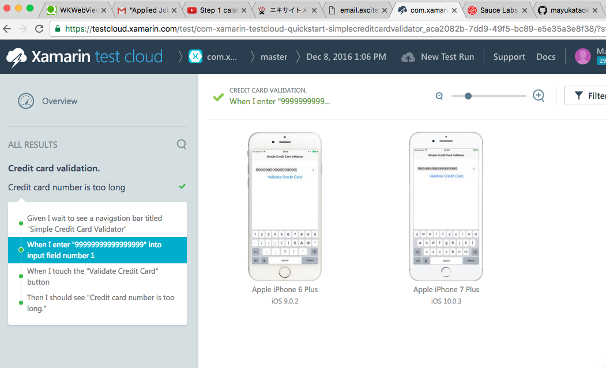

## Screenshots comparison from my test execution

###Sauce Labs

##Amazon Device Farm

##Test Cloud

## SauceLabs Cons

## SauceLabs Pros

## Test Cloud Cons

## Test Cloud Prod

## Amazon Device Farm Cons

## Amazon Device Farm Pros

